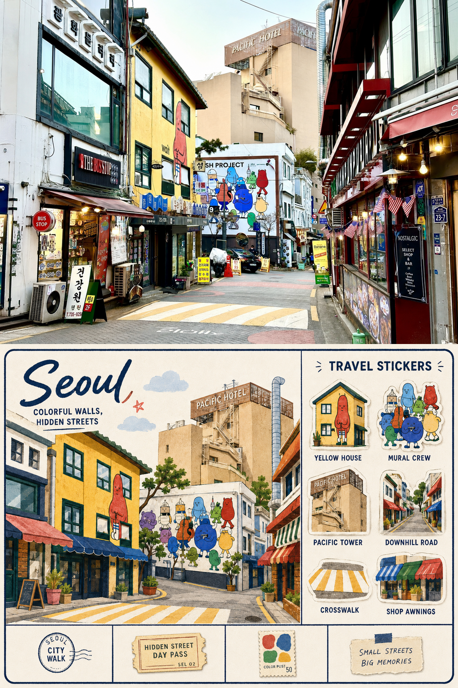
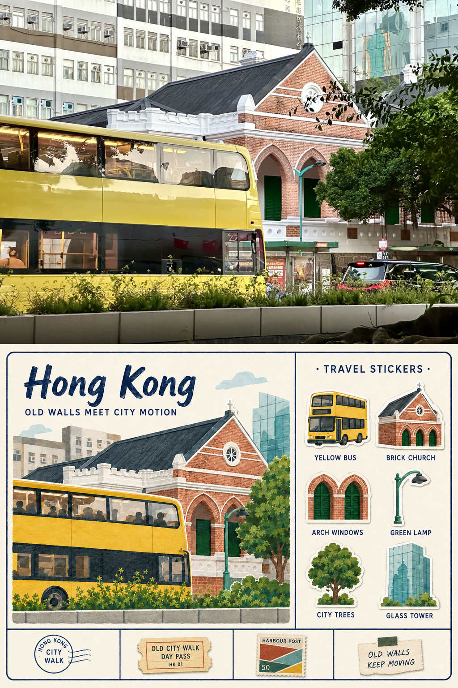
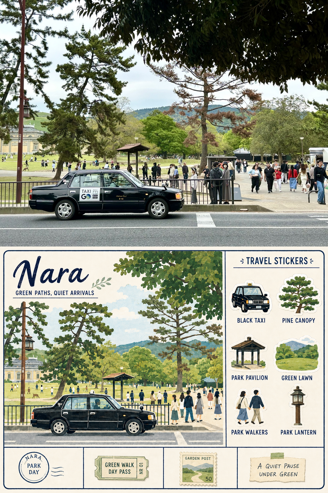
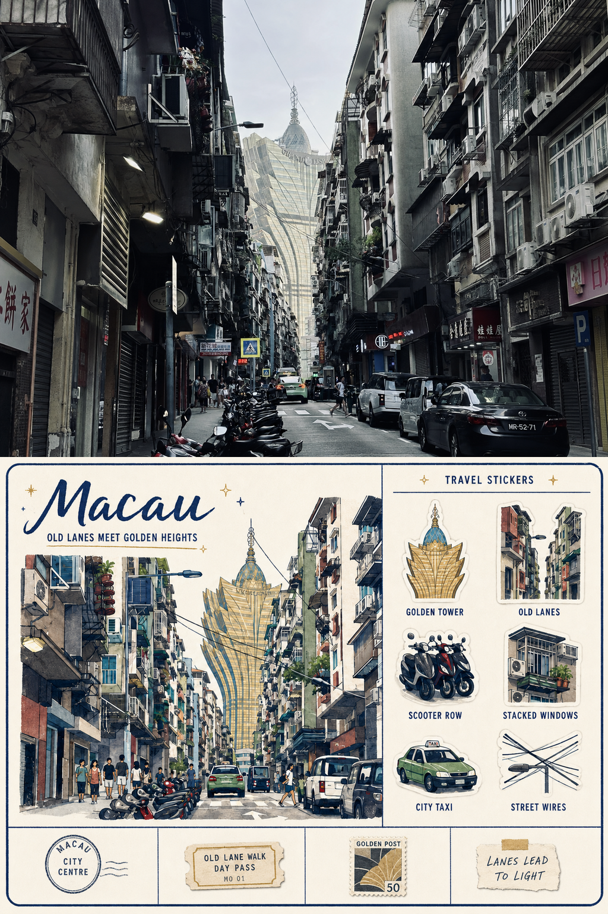

# YQ 旅行记忆海报

简体中文 | [English](README.md)

这是一个 Codex Skill，用于将旅行照片制作成统一风格的 2:3 竖版记忆海报：上半部分保留真实原图，下半部分搭配协调的插画旅行明信片手账卡。

## 案例效果

<table>
  <tr>
    <td align="center"><a href="examples/seoul.png"></a><br><strong>首尔</strong></td>
    <td align="center"><a href="examples/hong-kong.png"></a><br><strong>香港</strong></td>
  </tr>
  <tr>
    <td align="center"><a href="examples/nara.png"></a><br><strong>奈良</strong></td>
    <td align="center"><a href="examples/macau.png"></a><br><strong>澳门</strong></td>
  </tr>
</table>

## 安装

将本仓库克隆到 Codex 的 Skills 目录：

```bash
git clone https://github.com/YQ826/yq-travel-memory-poster.git ~/.codex/skills/yq-travel-memory-poster
```

如果 Skill 没有立即出现，请重启 Codex。使用时可以显式调用 `$yq-travel-memory-poster`，也可以上传旅行照片并要求按照该风格制作海报。

## 主要特点

- 每张照片生成一张独立的 2:3 竖版海报
- 上半部分忠实保留真实照片，不拉伸、不重绘
- 下半部分生成完整的 4:3 插画旅行手账卡
- 使用固定的版式、纸张质感、六枚旅行贴纸和四格纸质纪念物
- 支持批量制作，同时保持整组作品的视觉一致性
- 提供脚本进行精确的上下 50/50 合成

## 仓库内容

- `SKILL.md` — Skill 的触发范围与完整工作流程
- `agents/openai.yaml` — Codex 界面元数据
- `references/art-direction.md` — 视觉与材质方向
- `references/layout-spec.md` — 海报和卡片版式规范
- `references/prompt-template.md` — 图像生成提示词模板
- `scripts/compose_poster.py` — 确定性的 50/50 海报合成脚本
- `examples/` — 已完成的案例海报

## 合成脚本

脚本依赖 [Pillow](https://pypi.org/project/pillow/)。安装依赖后，可以使用以下命令合成海报：

```bash
python scripts/compose_poster.py \
  --photo path/to/photo.png \
  --card path/to/card.png \
  --output path/to/poster.png
```

默认输出为 `1024×1536` PNG。严格模式要求顶部照片和底部卡片均为 4:3，从而避免照片被意外裁切或拉伸。

## 许可证

本项目采用 [MIT License](LICENSE)。
